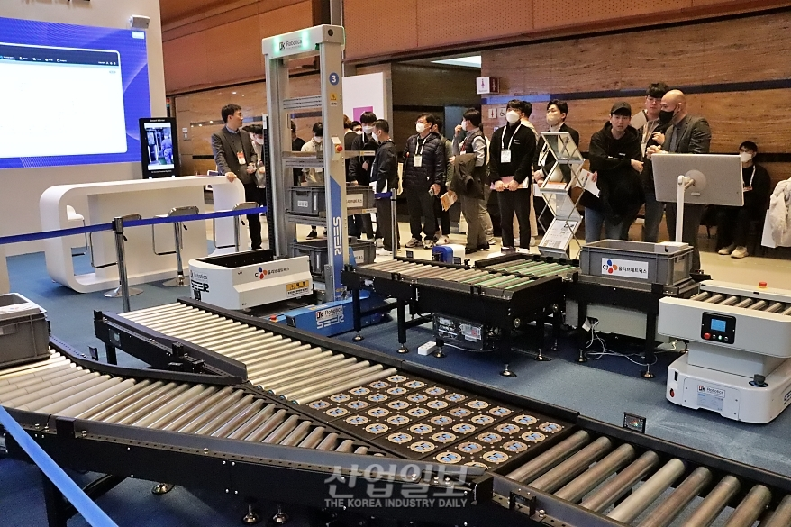
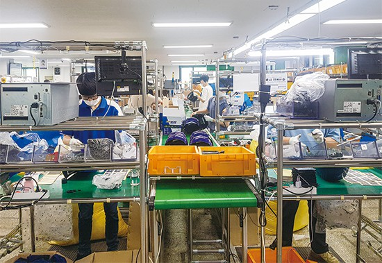
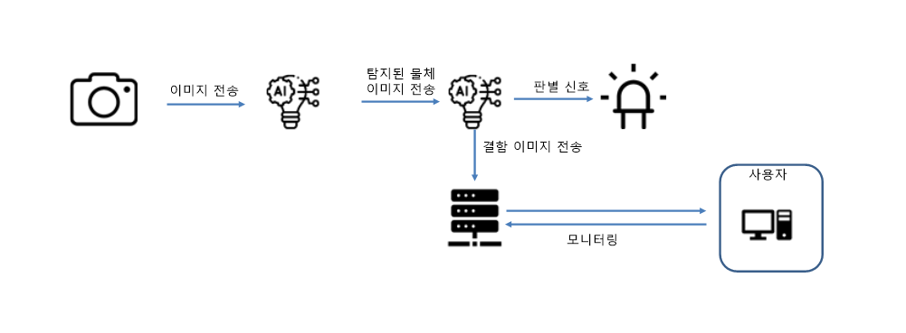
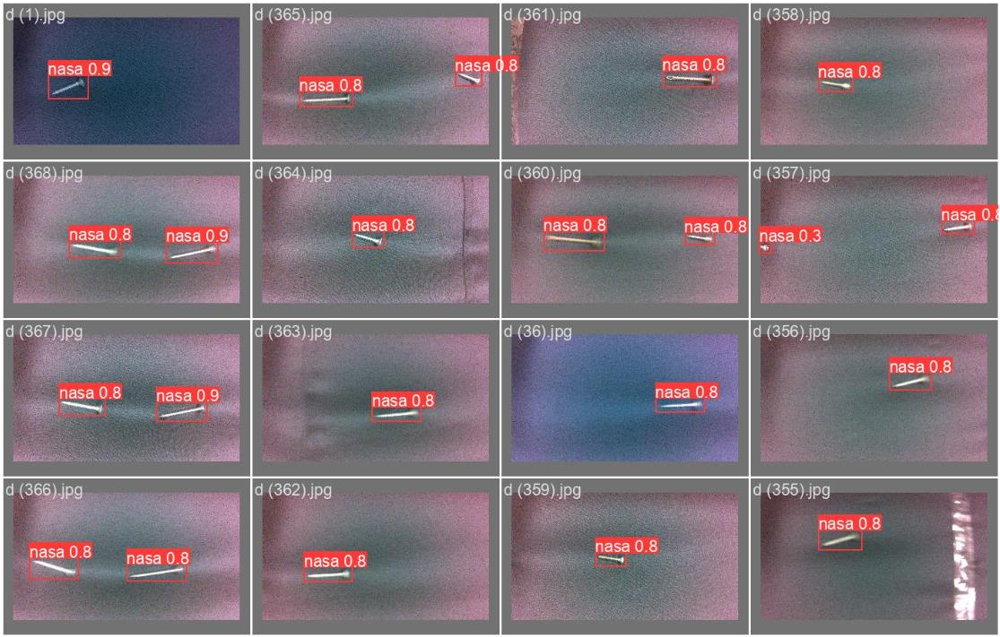
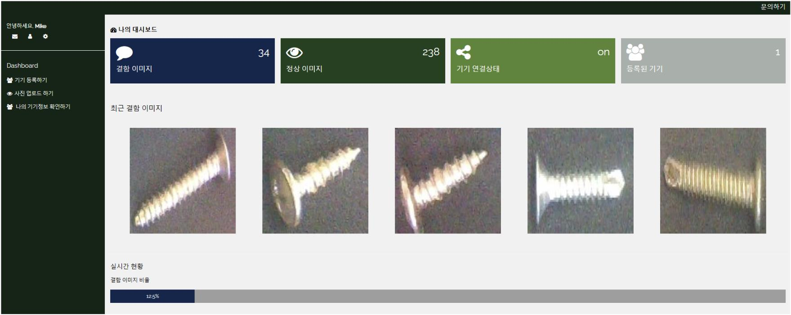
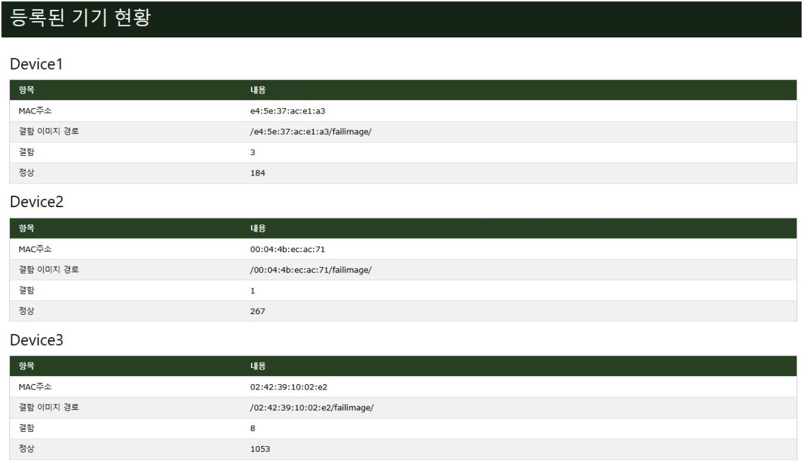
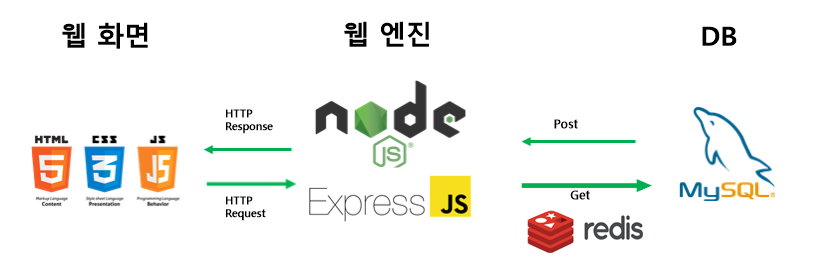

<!-- logo -->

# 🏭공장 표면 결함 검사 모니터링🔍

   
  

 

 

 
 

## 📜 프로젝트 개요
스마트 팩토리에서 육안 검사의 한계와 데이터 확보 어렵닫는 점, 새로운 품질 조건이나, 환경이 바뀔 때 마다 새로 데이터를 확보해야 한다는 문제를 개선하고자 프로젝트를 진행하게 되었습니다.

 

## 🛠️프로젝트 진행과정

 

 

 

 

## 📝 ERD 설계

 
